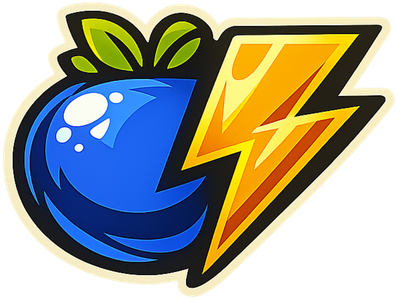

<p align="center">
  
</p>

<h1 align="center">BoltBerry</h1>

<p align="center">
  <strong>Lokales Virtual Tabletop für Pen-&amp;-Paper-Runden</strong><br>
  <em>Local-first Virtual Tabletop for tabletop RPG sessions</em>
</p>

<p align="center">
  
  
  
  
  
  
</p>

<p align="center">
  <a href="#deutsch">🇩🇪 Deutsch</a> &nbsp;·&nbsp; <a href="#english">🇬🇧 English</a>
</p>

---

## Deutsch

BoltBerry ist ein **kostenloser, quelloffener Virtual Tabletop (VTT)**, der vollständig lokal auf deinem Rechner läuft – ohne Konto, ohne Abo, ohne Internetverbindung.

- **DM-Fenster** – vollständige Steuerung für den Spielleiter
- **Spieler-Fenster** – überträgt Karte, Token, Handouts und Effekte in Echtzeit auf einen zweiten Bildschirm
- **SQLite-basiert** – alle Kampagnendaten lokal gespeichert, keine Cloud-Abhängigkeit
- **Mehrsprachig** – Benutzeroberfläche auf Deutsch und Englisch (DE/EN-Toggle in der Toolbar)

Gebaut mit Electron, React, TypeScript und SQLite. Läuft auf macOS, Windows und Linux.

### Features

| Kategorie | Funktion |
|---|---|
| **Karten** | Bilder oder PDFs importieren; Quadrat-/Hex-Raster; Drehung; Kamerasync pro Karte |
| **Fog of War** | Rechteck-, Polygon- und Zudecken-Werkzeuge; Delta-basierte Sync zum Spieler-Bildschirm |
| **Token** | Drag & Drop; TP-Leiste; Statuseffekte; Markierungsringe; Sichtbarkeits-Toggle; Sperren |
| **Initiative** | Sortierbarer Tracker; überträgt aktuellen Zug an Spieler-Overlay |
| **Notizen** | Pro-Kampagne und pro-Karte mit Markdown-Vorschau |
| **Handouts** | Bilder oder Textkarten direkt an den Spieler-Bildschirm senden |
| **Audio** | Hintergrundmusik (MP3/OGG/WAV) mit Schleife und Lautstärkeregelung |
| **Würfelsystem** | Schnelles Würfeln mit Verlauf, Vor-/Nachteil für d20 |
| **Wetter-FX** | Regen, Schnee, Wind und Nebel-Overlays auf dem Spieler-Bildschirm |
| **Overlays** | Titel-/Untertitel-Textoverlays für dramatische Momente |
| **Atmosphäre** | Vollbild-Bildmodus zwischen Begegnungen |

### Schnellstart

**Voraussetzungen:** Node.js 20+, npm 10+

```bash
git clone https://github.com/RollBerry-Studios/BoltBerry.git
cd BoltBerry
npm install
npm run dev
```

### Builds erstellen

```bash
npm run build          # Nur kompilieren
npm run dist           # Installer für aktuelle Plattform
npm run dist:mac       # macOS .dmg
npm run dist:win       # Windows .exe (NSIS)
npm run dist:linux     # Linux .AppImage + .deb
```

Fertige Builds liegen in `release/` und werden automatisch als [GitHub Releases](https://github.com/RollBerry-Studios/BoltBerry/releases) veröffentlicht.

### Projektstruktur

```
src/
  main/          Electron Main-Prozess (IPC, Datenbank, Fenster)
  preload/       Context Bridge (electronAPI / playerAPI)
  renderer/      React-App (DM-Ansicht)
    i18n/        Übersetzungen (DE/EN)
  shared/        Gemeinsame TypeScript-Typen
resources/       App-Icons (ICNS, ICO, PNG)
scripts/         Deployment-Hilfsskripte (Proxmox Runner-Setup)
```

### Tech-Stack

| Technologie | Verwendung |
|---|---|
| Electron 32 | Desktop-Shell (cross-platform) |
| React 18 + TypeScript 5 | Benutzeroberfläche |
| Vite 5 | Renderer-Bundler |
| Zustand 5 | State-Management |
| better-sqlite3 | Lokale Datenbank |
| Konva / react-konva | Canvas-Rendering |
| i18next / react-i18next | Mehrsprachigkeit (DE/EN) |
| pdfjs-dist | PDF-Import für Karten |

### CI/CD & Releases

Builds werden vollautomatisch per GitHub Actions erstellt. Ein neues Tag (`v*.*.*`) löst den Build für alle Plattformen aus und erstellt ein GitHub Release mit allen Installer-Dateien. Proxmox-VMs können als Self-Hosted Runners eingebunden werden – Setup-Script: [`scripts/setup-proxmox-runner.sh`](scripts/setup-proxmox-runner.sh).

### Mitwirken

Beiträge sind willkommen. Bitte lies [CONTRIBUTING.md](CONTRIBUTING.md) vor dem ersten PR.

### Lizenz

[MIT](LICENSE) © 2026 RollBerry Studios

---

## English

BoltBerry is a **free, open-source, offline-first Virtual Tabletop (VTT)** for tabletop RPG game masters. Runs entirely on your local machine — no accounts, no subscriptions, no internet required.

- **DM Window** — full control panel for the game master
- **Player Window** — sends map, tokens, handouts and effects to a second screen in real time
- **SQLite-backed** — all campaign data stored locally, no cloud dependencies
- **Multilingual** — UI available in German and English (DE/EN toggle in the toolbar)

Built with Electron, React, TypeScript and SQLite. Runs on macOS, Windows and Linux.

### Features

| Category | What you get |
|---|---|
| **Maps** | Import images or PDFs; square/hex grid; rotation; per-map camera sync |
| **Fog of War** | Rectangle, polygon, and cover tools; delta-based sync to player screen |
| **Tokens** | Drag & drop; HP bar; status effects; marker rings; visibility toggle; lock |
| **Initiative** | Sortable tracker; broadcasts current turn to player overlay |
| **Notes** | Per-campaign and per-map with Markdown preview |
| **Handouts** | Send images or text cards to the player screen |
| **Audio** | Background music (MP3/OGG/WAV) with loop and volume control |
| **Dice Roller** | Quick rolls with history, advantage/disadvantage for d20 |
| **Weather FX** | Rain, snow, wind and fog overlays on the player screen |
| **Overlays** | Title/subtitle text overlays for dramatic moments |
| **Atmosphere** | Full-screen image mode between encounters |

### Getting Started

**Prerequisites:** Node.js 20+, npm 10+

```bash
git clone https://github.com/RollBerry-Studios/BoltBerry.git
cd BoltBerry
npm install
npm run dev
```

### Building

```bash
npm run build          # Compile only
npm run dist           # Package for current platform
npm run dist:mac       # macOS .dmg
npm run dist:win       # Windows .exe (NSIS)
npm run dist:linux     # Linux .AppImage + .deb
```

Packaged output goes to `release/`. Binaries are published automatically as [GitHub Releases](https://github.com/RollBerry-Studios/BoltBerry/releases).

### Project Structure

```
src/
  main/          Electron main process (IPC, database, windows)
  preload/       Context bridge (electronAPI / playerAPI)
  renderer/      React app (DM view)
    i18n/        Translations (DE/EN)
  shared/        Shared TypeScript types
resources/       App icons (ICNS, ICO, PNG)
scripts/         Deployment helpers (Proxmox runner setup)
```

### Tech Stack

| Technology | Usage |
|---|---|
| Electron 32 | Cross-platform desktop shell |
| React 18 + TypeScript 5 | UI |
| Vite 5 | Renderer bundler |
| Zustand 5 | State management |
| better-sqlite3 | Embedded database |
| Konva / react-konva | Canvas rendering |
| i18next / react-i18next | Internationalisation (DE/EN) |
| pdfjs-dist | PDF → PNG for map import |

### CI/CD & Releases

Builds are fully automated via GitHub Actions. Pushing a tag (`v*.*.*`) triggers platform builds and creates a GitHub Release. Proxmox VMs can be registered as self-hosted runners — see [`scripts/setup-proxmox-runner.sh`](scripts/setup-proxmox-runner.sh).

### Contributing

Contributions are welcome. Please read [CONTRIBUTING.md](CONTRIBUTING.md) before opening a PR.

### License

[MIT](LICENSE) © 2026 RollBerry Studios
