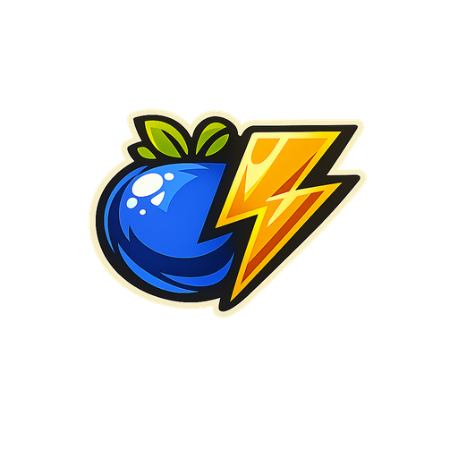

<p align="center">
  
</p>

<h1 align="center">BoltBerry</h1>

<p align="center">
  <strong>Local-first Virtual Tabletop for Pen &amp; Paper sessions</strong>
</p>

<p align="center">
  
  
  
  
  
  
</p>

---

BoltBerry is a **free, open-source, offline-first Virtual Tabletop (VTT)** built for tabletop RPG game masters. It runs entirely on your local machine — no accounts, no subscriptions, no internet required.

- **DM Window** — full control panel for the game master
- **Player Window** — sends map, tokens, handouts and effects to a second screen in real time
- **SQLite-backed** — all campaign data stored locally, no cloud dependencies

Built with Electron, React, TypeScript and SQLite. Runs on macOS, Windows and Linux.

---

## Features

| Category | What you get |
|---|---|
| **Maps** | Import images or PDFs; square/hex grid overlay; rotation; per-map camera sync |
| **Fog of War** | Rectangle, polygon, and paint-back tools; delta-based sync to player screen |
| **Tokens** | Drag & drop; HP bar; status effects; marker rings; visibility toggle; lock |
| **Initiative** | Sortable tracker; broadcasts current turn to player overlay |
| **Notes** | Per-campaign and per-map notes with inline Markdown preview |
| **Handouts** | Send images or text cards directly to the player screen |
| **Audio** | Background music player (MP3/OGG/WAV) with loop and volume control |
| **Dice Roller** | Quick dice rolls with history |
| **Weather FX** | Rain, snow, wind and fog overlays on the player screen |
| **Overlays** | Title/subtitle text overlays for dramatic moments |
| **Atmosphere** | Full-screen image mode between encounters |

---

## Getting Started

### Prerequisites

- [Node.js](https://nodejs.org/) 20 or later
- npm 10 or later

### Development

```bash
git clone https://github.com/RollBerry-Studios/BoltBerry.git
cd BoltBerry
npm install
npm run dev
```

This starts the Vite renderer dev server, the TypeScript watchers for main/preload, and the Electron process together.

### Build

```bash
# Build only (no packager)
npm run build

# Package for the current platform
npm run dist

# Platform-specific
npm run dist:mac
npm run dist:win
npm run dist:linux
```

Packaged output is placed in `release/`.

---

## Project Structure

```
src/
  main/          Electron main process (IPC, database, windows)
  preload/       Context bridge (exposes electronAPI / playerAPI)
  renderer/      React app (DM view)
  shared/        Shared TypeScript types (ipc-types.ts)
resources/       App icons (ICNS, ICO, PNG)
```

---

## Tech Stack

- **Electron 32** — cross-platform desktop shell
- **React 18 + TypeScript 5** — UI
- **Vite 5** — renderer bundler
- **Zustand 5** — state management
- **better-sqlite3** — embedded database (no server)
- **Konva / react-konva** — canvas rendering for maps and tokens
- **pdfjs-dist** — PDF → PNG conversion for map import

---

## Contributing

Contributions are welcome. Please read [CONTRIBUTING.md](CONTRIBUTING.md) before opening a PR.

---

## License

[MIT](LICENSE) © 2025 RollBerry Studios
